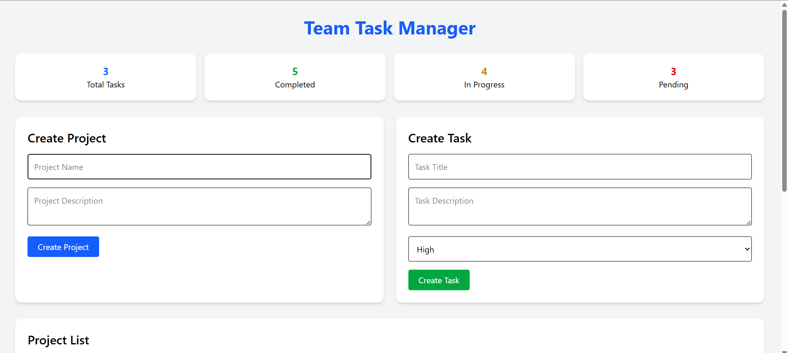
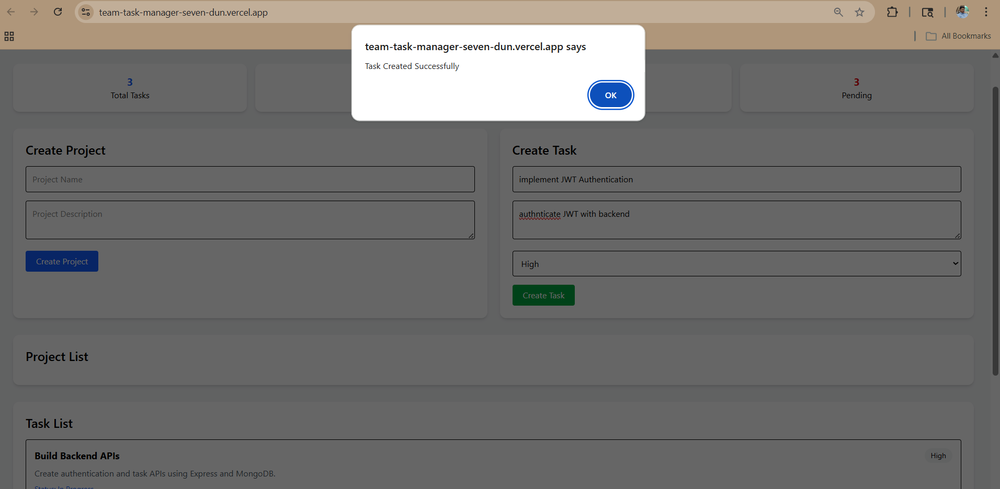

# Team Task Manager

A modern full stack Team Task Management application built using React, Node.js, Express, and MongoDB.

---

# Live Demo

## Frontend
https://team-task-manager-seven-dun.vercel.app/

## Backend API
https://team-task-manager-backend-mvas.onrender.com/

---

# Features

- JWT Authentication
- Create and manage projects
- Create and manage tasks
- Dashboard statistics
- Task priority management
- Responsive UI
- REST API integration
- MongoDB Atlas database
- Full stack deployment

---

# Tech Stack

## Frontend
- React.js
- Vite
- Axios
- Tailwind CSS

## Backend
- Node.js
- Express.js
- MongoDB Atlas
- Mongoose
- JWT Authentication
- bcryptjs

---

# Folder Structure

```bash
Team-Task-Manager/
│
├── client/
├── server/
└── README.md
```

---

# API Endpoints

## Authentication

### Signup

```http
POST /api/auth/signup
```

### Login

```http
POST /api/auth/login
```

---

## Projects

### Create Project

```http
POST /api/projects
```

---

## Tasks

### Create Task

```http
POST /api/tasks
```

---

# Local Setup

## Clone Repository

```bash
git clone https://github.com/rithik-cyber/Team-Task-Manager.git
```

---

# Backend Setup

```bash
cd server
npm install
npm run dev
```

Create `.env` file inside `server` folder:

```env
PORT=5000
MONGO_URI=your_mongodb_connection_string
JWT_SECRET=supersecretkey
```

---

# Frontend Setup

```bash
cd client
npm install
npm run dev
```

---

# Deployment

## Frontend
- Vercel

## Backend
- Render

---

# Dashboard Features

- Total Tasks Counter
- Completed Tasks Counter
- In Progress Tasks Counter
- Pending Tasks Counter

---

# Screenshots

## Full Dashboard



---

## Create Task



---

# Future Improvements

- User role management
- Real-time collaboration
- Task deadlines
- Notifications system

---

# Author

## Rithik Kumar

GitHub:
https://github.com/rithik-cyber